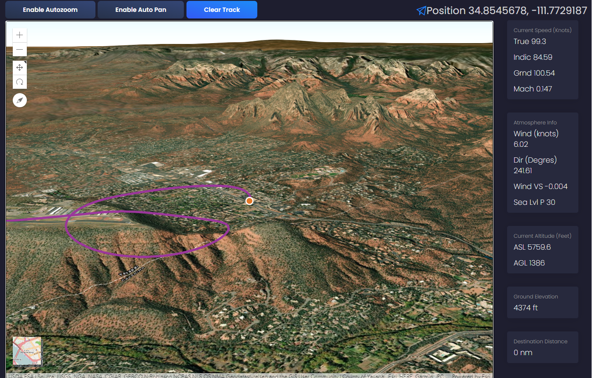

# MSFS FLIGHT MAPPER
## Track flight in 3D in stand alone browser app. 

Flight mapping tool is in early development and may have bugs. Access by clicking the flight mapping tab at top of localhost:5000 page. 
## October 12, 2020: Mapping 2.0
- **Run the App with an EXE! No more python requirements
- **Rebuilt mapping based on ESRI Sceneview 3D mapping tools
- **Cleaned UI
- **ToDo: Add abilty to save out a flight track with several flight variables in CSV/SHP/KML

## Stand Alone EXE Run Guide 
- Download msfs_flightmapper.exe from the dist folder
- Start MSFS 2020
- Run msfs_flightmapper.exe
- navigate to localhost:5001 (127.0.0.1:5001) in a browser of your choice
 

## TO RUN PYTHON SCRIPT Requirements
-	Python 3.7 64-bit or later
-	Python SimConnect library
-	Flask library

## Installation
1. Install the latest Python 3 64-bit Release for Windows. Download the installer from the official [Python website](https://www.python.org/downloads/windows/). Here is a direct link to the [Python 3.8.6 64-bit installer](https://www.python.org/ftp/python/3.8.6/python-3.8.6-amd64.exe). Tick the *Add Python 3.8 to PATH* checkbox when installing Python.
2. Run Command Prompt. Do this by pressing <kbd>Win</kbd> + <kbd>R</kbd>. Type *cmd.exe* and click OK.
3. In the Command Prompt window type *pip install flask* and press <kbd>Enter</kbd>. When asked to download any other Python dependencies, type *y* and press <kbd>Enter</kbd>. This will install the Flask Python library.
4. When finished installing Flask type *pip install SimConnect* and press <kbd>Enter</kbd>. When asked to download any other Python dependencies, type *y* and press <kbd>Enter</kbd>.

## Running MSFS Landing Inspector
1. Start a flight in Microsoft Flight Simulator
2. Download and unzip the MSFS Landing Inspector repository and run *start.bat* by double-clicking on it. This should launch a Command Prompt window. Don't close this window.
3. Open your browser and load the site *localhost:5001*. This should load up the MSFS Landing Inspector in your browser.

## Running MSFS Landing Inspector on your mobile device
1. Make sure your PC and your mobile device are connected to the same local network and that your home network is set to *Private* in your Network Profile settings. 
2. Run Command Prompt. Do this by pressing <kbd>Win</kbd> + <kbd>R</kbd>.
3. In the Command Prompt window type *ipconfig* and press <kbd>Enter</kbd>. Look for the line *IPv4 Address* and write down the IP address. In my case, it's *192.168.0.120*. You will most likely have a different IP address. Close the Command Prompt window.
4. Start a flight in Microsoft Flight Simulator
5. Download and unzip the MSFS Landing Inspector repository and run *msfs_landing_inspector.py* by double-clicking on it. This should launch a Command Prompt window. Don't close this window.
6. On your mobile device, load the following site in the browser: *<IP address you've written down>:5000*. In my case, this would be *192.168.0.120:5000*. MSFS Landing Inspector should now load on your mobile device.

## Credits
MSFS Flight uses ESRI JS api 4, the Python [SimConnect](https://pypi.org/project/SimConnect/) library and the CSS theme [Black Dashboard](https://www.creative-tim.com/product/black-dashboard) by [Creative Tim](https://www.creative-tim.com/) for the web front-end.

